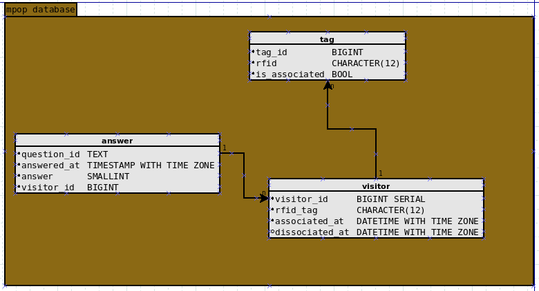
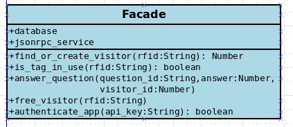
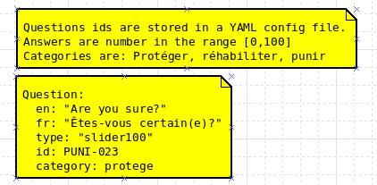

# Architecture logicielle

## Interface graphique des kiosques formulaires

Pour les questionnaires, notre choix s'arrête actuellement sur une application
en JavaScript avec Electron, React et Ant Design. Le fait que les gens sont
familiers avec les interfaces Web motive ce choix. De plus, il serait très
facile de trouver des développeurs Web, en cas de besoin.
Le désavantage de ce choix est que cela mènera à une application un peu
plus lente que si elle était développée en C++ ou Python, par exemple.

## Interface graphique pour la visualisation de données

Pour la visualisation des données, la librairie D3.js semble des plus
intéressantes. https://d3js.org/
Si nous optons pour ce choix, il se peut que ses performances ne soient pas
satisfaisantes. En effet, une application Electron en JavaScript peut être
plutôt lente. Ce n'est pas un problème pour les formulaires des kiosques,
mais pour la visualisation des données, il serait important d'avoir des
animations bien fluides.

Parmis les alternatives possibles:

- VTK (C++) https://vtk.org/vtk-in-action/#image-gallery
- matplotlib (Python) https://matplotlib.org/
- Qt Data Visulization (C++ ou QML) https://doc.qt.io/archives/qt-5.11/qtdatavisualization-module.html
- Qwt (C++ ou QML) https://qwt.sourceforge.io/
- Écrire une application avec OpenGL et SDL ou wxWidgets (C++) https://www.wxwidgets.org/

Parmi ces choix, une application OpenGL avec wxWidgets semble particulièrement
intéressante, car nous avons beaucoup d'expérience avec ces technologies.
Le choix final entre D3.js et wxWidgets ou autre sera fait lorsque les requis
pour cette composantes seront mieux connus.

## RFID

Nous utilisons des tags RFID pour identifier les participants.

Voici quelques tags RFID que nous avons:

```TEXT

2900AA840700
2900AD838186
2900AD8D040D
2900ADB6083A
2900ADF77A09
2900AE190799
2900AE269130
2900AE5CA873
2900E953EA79
2900EC7D2890
6400DAB81F19
6400DC39BA3B
```

À la fin du parcours, les visiteurs doivent déposer leur carte RFID dans un
contenant où se trouve le lecteur ultime.
Ce lecteur va réinitialiser la carte, et la rendre disponible pour un nouvel
usager.

Comme lecteur RFID, nous utilisons celui du Sparkfun RFID Starter Kit, via USB,
grâce à la puce FTDI. This kit includes our USB RFID Reader, ID-12LA RFID
module, and two 125kHz RFID cards. Open a terminal program of your choice at
9600bps 8N1. (eight (8) data bits, no (N) parity bit, and one (1) stop bit.)

Le protocole sériel ce kit utilise inclut un espace avant le texte du numéro de
série, un espace après, puis un charactère newline. Comme ceci:

```TEXT
 2900E953EA79 
```

Nous prévoyons créer une librairie JavaScript pour ce faire, basée sur
le module serialport.

- Détecter les contrôlleurs USB FTDI branchés.
- Se connecter au premier.
- Se reconnecter en cas de déconnexion
- Recevoir les numéros de puces RFID détectées.
- Envoyer ces informations au clients qui l'observent.

## Base de données

Comme base de données, nous préférons les systèmes de base de données SQL plutôt
que noSQL, car la maintenance sera plus facile.

On peut prendre Flyway pour gérer les migrations de base de données. Le tout
dans des conteneurs Docker fonctionnant sur un hôte Windows 10.

### Schema

Voici le schéma prévu pour notre base de données:



## Service pour stocker les réponses

Voici la signature des méthodes de notre API:



Une interface JSON-RPC 2.0 va imiter fournir des méthodes semblables aux
clients.

## Configuration des questions

Un fichier YAML sur chaque ordi servira à configurer les questions. Tous les
ordis ont ces questions.



